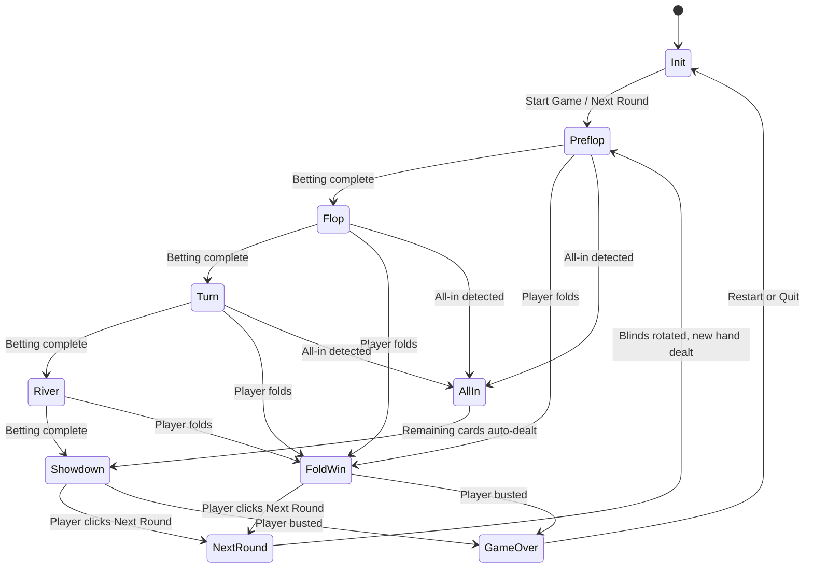

# Game Flow

## Overview

This document describes the complete game lifecycle from initialization through round play to game over, including phase transitions, dealing sequences, and betting order.

## Requirements

### Game Initialization

| ID | Requirement | Status | Notes |
|----|-------------|--------|-------|
| GF-001 | Show initialization overlay on app load | Done | Full-screen overlay with backdrop blur |
| GF-002 | Player name input (max 20 chars, defaults to "Player1") | Done | Text input with autofocus |
| GF-003 | Starting blind position selection (BB or SB) | Done | Radio buttons |
| GF-004 | Display game rules summary on init screen | Done | Bullet list: $100 starting, blind rotation, bust condition |
| GF-005 | Start Game button (disabled if name is empty) | Done | Triggers `startGame()` |
| GF-006 | Enter key triggers game start from init screen | Done | `handleInitialScreenKeyPress()` |

### Round Lifecycle

| ID | Requirement | Status | Notes |
|----|-------------|--------|-------|
| GF-010 | Round number tracking | Done | `roundNumber` state, incremented each round |
| GF-011 | Blind rotation between rounds | Done | `isSmallBlind`/`isBigBlind` swap in `startNextRound()` |
| GF-012 | Chips persist across rounds | Done | Only blind deductions at round start |
| GF-013 | Next Round button appears after hand completes | Done | In status container, triggers `handleShowdownModalClose()` |

### Dealing Sequence

| ID | Requirement | Status | Notes |
|----|-------------|--------|-------|
| GF-020 | Post blinds ($5 SB, $10 BB) at round start | Done | Deducted from chips, added to pot |
| GF-021 | Deal hole cards: BB gets card 1, SB gets card 2, BB gets card 3, SB gets card 4 | Done | Staggered 300ms between each card |
| GF-022 | Burn 1 card before each community deal | Done | Burn card added to `burnedCards` array |
| GF-023 | Flop: deal 3 community cards | Done | Staggered 900ms between each card |
| GF-024 | Turn: deal 1 community card | Done | Single card with animation |
| GF-025 | River: deal 1 community card | Done | Single card with animation |
| GF-026 | Always show 5 community card slots | Done | Empty placeholder cards for undealt positions |
| GF-027 | Always show 3 burn card slots | Done | Transparent empty slots until burned |

### Betting Order

| ID | Requirement | Status | Notes |
|----|-------------|--------|-------|
| GF-030 | Preflop: Small Blind acts first | Done | `getFirstPlayerIndex()` returns SB index for preflop |
| GF-031 | Postflop (flop/turn/river): Big Blind acts first | Done | `getFirstPlayerIndex()` returns BB index for postflop |
| GF-032 | Alternate between players until betting round complete | Done | `getNextActivePlayerIndex()` |
| GF-033 | Betting round complete when all active players have acted AND matched current bet | Done | `isBettingRoundComplete()` checks `hasActedThisRound` and `currentBet` match |
| GF-034 | Reset `hasActedThisRound` and `currentBet` at each new betting phase | Done | In `advanceGamePhase()` phase transition |

### Phase Transitions

| ID | Requirement | Status | Notes |
|----|-------------|--------|-------|
| GF-040 | Preflop -> Flop: burn + deal 3 | Done | `advanceGamePhase()` switch case |
| GF-041 | Flop -> Turn: burn + deal 1 | Done | Same function |
| GF-042 | Turn -> River: burn + deal 1 | Done | Same function |
| GF-043 | River -> Showdown: reveal AI cards, determine winner | Done | AI card flip animation, then `determineWinner()` |
| GF-044 | Disable betting controls during dealing animations | Done | `isDealing` flag checked in button state |
| GF-045 | Disable betting controls during hole card animation | Done | `holeCardAnimating` flag |

### Fold Win

| ID | Requirement | Status | Notes |
|----|-------------|--------|-------|
| GF-050 | When a player folds, remaining player wins pot immediately | Done | `handleFoldWinWithPot()` |
| GF-051 | AI cards stay hidden on fold win (no showdown) | Done | `gamePhase` not set to showdown |
| GF-052 | Status container shows "[Player] folded" message | Done | Detected from `players.find(p => p.hasFolded)` |

### All-In Auto-Deal

| ID | Requirement | Status | Notes |
|----|-------------|--------|-------|
| GF-060 | Detect all-in when any active player has 0 chips after betting complete | Done | `anyPlayerAllIn` check in `advanceGamePhase()` and `handleBettingAction()` |
| GF-061 | AI cards flip face-up before runout begins | Done | `setAiCardsFlipping(true)` at start of `dealRemainingCommunityCards()` |
| GF-062 | Deal remaining community cards with animated timing | Done | Pre-dealt from deck, then revealed with staggered `setTimeout` |
| GF-063 | Show phase name updates as each street is dealt | Done | `setGamePhase()` called during runout |
| GF-064 | Proceed to showdown after all cards dealt | Done | `determineWinner()` called with pre-computed final community cards |

### Game Over

| ID | Requirement | Status | Notes |
|----|-------------|--------|-------|
| GF-070 | Game over when a player's chips < $10 (big blind) | Done | Checked after every pot award |
| GF-071 | Show Victory screen (human wins) or Defeat screen (AI wins) | Done | Conditional emoji and message in status container |
| GF-072 | Restart button: reset to round 1 with same name/blinds, re-deal | Done | `restartGame()` |
| GF-073 | Quit button: return to initialization screen | Done | `handleQuitGame()` -> `resetGame()` |

## Current Implementation

- All game flow logic lives in `src/App.tsx` as a set of functions and `useEffect` hooks
- AI turn is auto-triggered by a `useEffect` watching `currentPlayerIndex`, `gamePhase`, and related state
- Phase transitions use nested `setTimeout` chains for animation sequencing
- Stale closure issues are mitigated by passing values as function parameters rather than relying on React state

## Design Decisions

- **setTimeout chains for animations:** React state updates are asynchronous, so `setTimeout` chains sequence dealing and phase transitions. This is simple but fragile -- a state management refactor could use async/await or animation libraries instead.
- **BB deals first card:** Standard casino practice where the big blind receives the first card.
- **SB acts first preflop, BB acts first postflop:** Standard heads-up Texas Hold'em rules.
- **No auto-advance on fold:** The status container shows the result and waits for "Next Round" click, giving the player time to review.

## Open Questions / Known Issues

- The nested `setTimeout` chain in `dealNewHand()` and `advanceGamePhase()` can cause race conditions if the user triggers actions during animations. The `isDealing` and `holeCardAnimating` flags mitigate this but are not bulletproof.
- `advanceGamePhase()` and `handleBettingAction()` both handle fold/all-in scenarios, leading to some code duplication.
