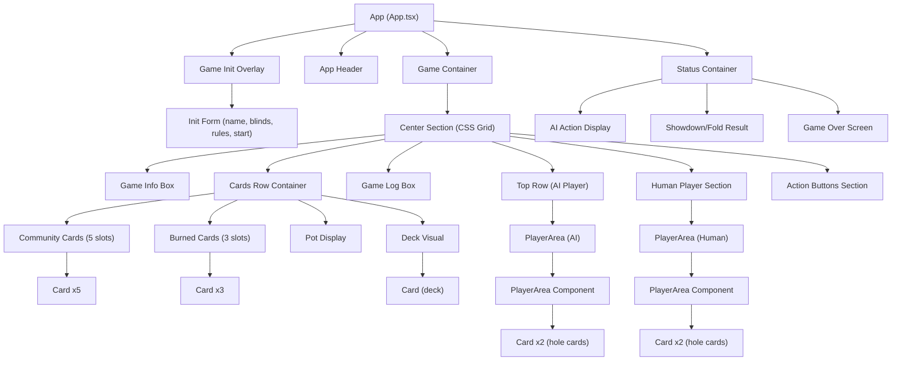

# Layout & Components

## Overview

This document defines the component hierarchy, screen layouts, and interactive controls of the poker game UI. The layout uses CSS Grid for the main game board and Flexbox for internal component arrangement.

## Requirements

### Component Hierarchy

| ID | Requirement | Status | Notes |
|----|-------------|--------|-------|
| LC-001 | App wraps entire game in single root `div.App` | Done | Full viewport height, gradient background |
| LC-002 | Header with game title | Done | `h1` "Texas Hold'em Poker" |
| LC-003 | Game container with max-width 1400px, centered | Done | CSS variable `--container-max-width` |

### Game Initialization Overlay

| ID | Requirement | Status | Notes |
|----|-------------|--------|-------|
| LC-010 | Fixed full-screen overlay with backdrop blur | Done | `position: fixed; inset: 0; z-index: 1000` |
| LC-011 | Centered white card with rounded corners | Done | `.game-init-screen` with 95% white background |
| LC-012 | Player name text input (autofocus, max 20 chars) | Done | Defaults to "Player1" |
| LC-013 | Blind position radio buttons (Big Blind / Small Blind) | Done | With dollar amounts shown |
| LC-014 | Game rules summary section | Done | Blue-bordered info box with bullet list |
| LC-015 | Start Game button (green gradient) | Done | Disabled when name is empty |
| LC-016 | Enter key shortcut to start | Done | `onKeyPress` handler |

### Center Section (CSS Grid)

| ID | Requirement | Status | Notes |
|----|-------------|--------|-------|
| LC-020 | 3-column grid: game-info / main / game-log | Done | `grid-template-columns: 250px 1fr 425px` |
| LC-021 | 3-row grid: top / cards / bottom | Done | `grid-template-areas` defines layout |
| LC-022 | Game Info Box in top-left | Done | Shows round number, phase, current bet |
| LC-023 | AI Player centered in top-middle | Done | `PlayerArea` component |
| LC-024 | Game Log in top-right | Done | Scrollable, auto-scrolls to bottom |
| LC-025 | Cards row spans full width | Done | Grid area: `cards-row cards-row cards-row` |
| LC-026 | Human Player in bottom-left/center | Done | `PlayerArea` component |
| LC-027 | Action Buttons in bottom-right | Done | Glassmorphism panel |

### Cards Row (CSS Grid)

| ID | Requirement | Status | Notes |
|----|-------------|--------|-------|
| LC-030 | 4-column grid: pot / community / deck / burn | Done | Fixed widths for pot (250px), deck (130px), burn (280px) |
| LC-031 | Pot display with large gold dollar amount | Done | 48px font, gold color with text-shadow |
| LC-032 | Community cards: 5 card slots in a row | Done | Empty placeholders for undealt cards |
| LC-033 | Deck visual: single face-down card with stacked effect | Done | `isDeck` prop on Card component |
| LC-034 | Burn cards: 3 card slots | Done | Face-down when burned, transparent when empty |

### PlayerArea Component

| ID | Requirement | Status | Notes |
|----|-------------|--------|-------|
| LC-040 | Player name with folded indicator | Done | "(FOLDED)" appended when folded |
| LC-041 | Position badges (Small Blind / Big Blind) | Done | Gradient green-to-blue badges |
| LC-042 | Chip stack with gold background and dollar amount | Done | Chip icon + formatted amount |
| LC-043 | Current bet display (when > 0) | Done | "Bet: $X" in subtle pill |
| LC-044 | Last action display | Done | "Last: Check/Call/Raise/Fold" in green pill |
| LC-045 | Turn indicator badge (bouncing, above card) | Done | Orange gradient "TURN" badge with arrow |
| LC-046 | 2 hole cards displayed | Done | Face-up for human, face-down for AI (except showdown) |
| LC-047 | Showdown hover interaction | Done | `onHandHover`/`onHandLeave` for card highlighting |
| LC-048 | Card highlighting: used cards glow, unused dim | Done | Green glow for human, blue for AI |

### Card Component

| ID | Requirement | Status | Notes |
|----|-------------|--------|-------|
| LC-050 | Three size variants: small (60x84), medium (80x112), large (100x140) | Done | CSS classes `card--small/medium/large` |
| LC-051 | Face-up state: rank + suit in corners, large suit in center | Done | Standard card layout |
| LC-052 | Face-down state: dark gradient with crosshatch pattern | Done | `.card__back` with `.card__pattern` |
| LC-053 | Empty state: transparent placeholder | Done | `card--empty` with 0.3 opacity |
| LC-054 | Deck state: face-down with stacked depth (::before, ::after) | Done | 3-layer stack effect |
| LC-055 | Burned state: face-down or empty slot | Done | `isBurned` prop |
| LC-056 | Flipping state: 3D card flip animation | Done | `card--flipping` with `card__flip-container` |
| LC-057 | Dealing state: fly-in animation | Done | `card--dealing` keyframe |
| LC-058 | Highlighted state: glow effect (green or blue) | Done | Multi-layer box-shadow |
| LC-059 | Dimmed state: grayed and shrunk | Done | `card--dimmed` with reduced opacity |
| LC-060 | Raised state: lifted on hover during showdown | Done | `card--raised` translateY(-20px) |

### Betting Controls

| ID | Requirement | Status | Notes |
|----|-------------|--------|-------|
| LC-070 | Fold button (red gradient) | Done | Always available during player's turn |
| LC-071 | Call/Check button (blue gradient) | Done | Label changes based on amount: "Check" or "Call $X" |
| LC-072 | Raise input with $5 increments | Done | Read-only input with up/down arrow buttons |
| LC-073 | Raise button (orange gradient) | Done | Validates amount against chips and opponent's ability to call |
| LC-074 | All controls disabled when not player's turn | Done | `disabled` prop + visual dimming (0.5 opacity) |
| LC-075 | Validation error shown via browser alert | Done | `alert()` on invalid actions |

### Game Log

| ID | Requirement | Status | Notes |
|----|-------------|--------|-------|
| LC-080 | Scrollable log with timestamps | Done | `HH:MM:SS` format |
| LC-081 | Auto-scroll to newest entry | Done | `useEffect` on `gameLog` state, scrolls `logEntriesRef` |
| LC-082 | Custom scrollbar styling | Done | Thin 6px scrollbar with subtle colors |
| LC-083 | Logs dealing, betting actions, phase changes, winners | Done | Messages added throughout game flow |

### Status Container

| ID | Requirement | Status | Notes |
|----|-------------|--------|-------|
| LC-090 | Positioned below game board | Done | Full width, z-index 200 |
| LC-091 | Shows AI thinking animation during AI turn | Done | Robot emoji + "AI is thinking..." + animated dots |
| LC-092 | Shows AI action result (folds/checks/calls/raises) | Done | Orange text with amount |
| LC-093 | Shows showdown result (winner, hand comparison) | Done | Crown/handshake emoji, hand descriptions |
| LC-094 | Shows fold result (winner, "opponent folded") | Done | Simpler display without hand comparison |
| LC-095 | Shows game over screen (victory/defeat) | Done | Black background with gold border, restart/quit buttons |
| LC-096 | Next Round button after hand completes | Done | Red-orange gradient button |
| LC-097 | Hidden when no active content | Done | `visibility: hidden` class toggle |

## Current Implementation

- **App.tsx:** Renders all layout sections inline (no separate layout component)
- **Card.tsx:** Handles all card visual states via props (`hidden`, `isDealing`, `isFlipping`, `isHighlighted`, `isDeck`, `isBurned`)
- **PlayerArea.tsx:** Displays player info and delegates card rendering to Card component

## Design Decisions

- **All layout in App.tsx:** No separate layout or page components. The game is a single screen with overlays, so this is acceptable.
- **CSS Grid for main layout:** Provides precise control over the complex multi-area board layout. Flexbox is used within individual components.
- **Card component handles all states:** Rather than separate DeckCard, BurnCard, etc., a single Card component uses props to determine rendering. This centralizes card styling but makes the prop interface wide.
- **Alert for validation errors:** Quick implementation. A proper toast/snackbar system would be better UX.

## Open Questions / Known Issues

- The init overlay uses `onKeyPress` which is deprecated. Should migrate to `onKeyDown`.
- Raise input is read-only (arrow buttons only). A future enhancement could allow direct typing.
- Mobile layout stacks all sections vertically, which works but makes the game tall. A dedicated mobile layout could be more compact.
